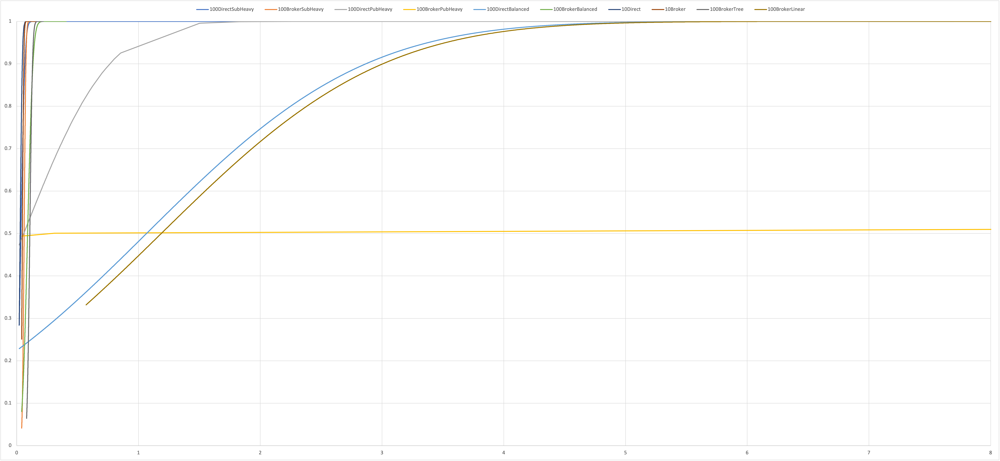
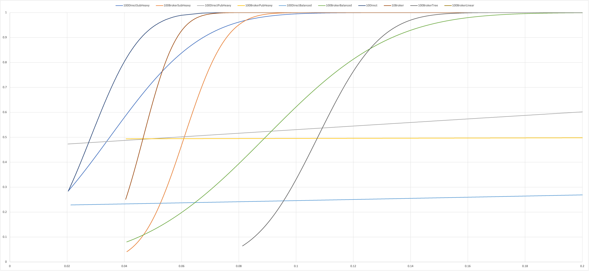

# CS6381 Programming Assignment 2

The tests folder contains a file named 'sourcegen.xlsx' - this was used to generate the command source files for mininet consistent with my applications. The tests in the same folder are the ones I ran for PA2 (and PA1), though I did not report on the ones with only two pub/sub hosts.

Execution of this system can be accomplished by running these apps in any order, concurrently:
- registryapp.py (must specify dissemination method number of other registries)
- brokerapp.py (if desired, requires registry IP, number of registries)
- subapp.py (as many of these as desired, requires registry IP and number of registries)
- pubapp.py (as many of these as desired, requires registry IP)

The system defaults to 1000 publish calls per publisher with random topics and data. The system assumes the registry IP addresses are the first [x] IPs starting at 10.0.0.1 for the number of registries provided.

Initial start should see all publishers registered with the same registry. They will detect loss of registry and compensate after startup.
Publisher stop requests are not coded to detect loss of registry at this time. There is a known issue where writes to the registry from secondary nodes do not function, though reads seem fine.

For most experiments (unless otherwise noted) my mininet setup was:
mn --topo=single,{num hosts} --link=tc,bw=100,delay=10ms

# Results
Comparisons between time to broker vs time to subscriber were not examined in this assignment.

Running with just 10 hosts gives expected results of very fast transmission times, and with the direct method outperforming the broker method due to the extra network hop.

I loaded the system with 100 pub/sub hosts, and tested these in a balanced configuration (50/50), a publisher heavy configuration (90/10) and a subscriber heavy configuration (90/10).

For a loaded system, the worst performers were similar:
- A balanced system with a broker using a linear network configuration
- A balanced system with direct dissemination on a single topology

We had some intermediate results from a publisher heavy system with direct dissemination.
We had significant outliers with the publisher heavy system with broker dissemination that took an otherwise good performance and trashed the curve.

The best performer was a subscriber heavy load using direct dissemination.

I expected the results from PA2 to mirror PA1, and they didn't at all. There is a lot of variability in the number of rows of data collected for each experiment, and I believe that may make the comparisons harder. Memory and CPU limitations also reduce the reliability of the data collected.

When all this was done, I took the single topology with 100 hosts (balanced broker) and tested this in the linear(102) and tree(depth=3,fanout=5) topologies. The tree topology had significantly faster performance, and the linear topology was by far the worst of the entire experiment. The reason for this poor peformance is most likely due to pegging out the virtual machines CPU and memory, and so this experiment should be repeated on a more powerful machine.

# Conclusion
The performance characteristics of the system depend heavily on the composition and size of the system. With that in mind, however, the only time the broker method performed significantly worse was in a publisher heavy configuration, which is atypical for the purposes of pub/sub.

Video can be found until the end of May, 2022 at https://vanderbilt.zoom.us/rec/share/Zr4sK-wqt1fz_l5t3jbUd80Q5h-L_ABtbH79IM0Fk6U16V68YIKNkJPQjbGnl_0h.mloyGTCtpYMCZxA2?startTime=1644643504000
