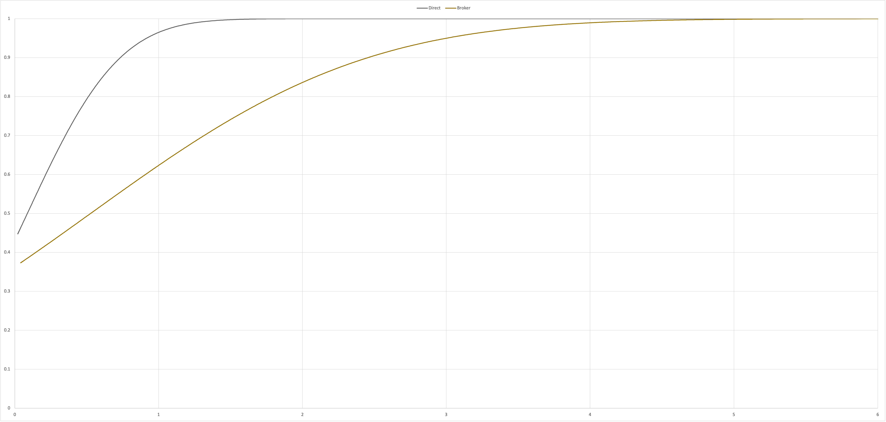

# CS6381 Programming Assignment 4

The tests folder contains a file named 'sourcegen.xlsx' - this was used to generate the command source files for mininet consistent with my applications. Working through the milestones, not everything that was run for previous assignments made sense to continue with in this case. We tested two main options using a balanced approach of publishers and subscribers, with 4 registries and 4 brokers (when there are brokers). 2 brokers assigned to each of backup and primary pools. The two test cases were with and without brokers.

Execution of this system can be accomplished by running zookeeper, then these apps in any order, concurrently:
- registryapp.py (must specify dissemination method if using broker)
- brokerapp.py (if desired)
- subapp.py
- pubapp.py

The system defaults to 1000 publish calls per publisher with random topics and data. The system assumes the zookeeper is at 10.0.0.1 and queries zookeeper for registries and brokers.

Initial start should see all publishers registered with the same registry. They will detect loss of registry and compensate after startup.
Publisher stop requests are not coded to detect loss of registry at this time. There is a known issue where writes to the registry from secondary nodes do not function, though reads seem fine.

For most experiments (unless otherwise noted) my mininet setup was:
mn --topo=single,{num hosts}

Load balancing was done by using the subscriber to report a running average of latency back to the registry when checking for publisher updates. A setpoint was established in the registry to enable balancing, with a hysterisis setting to disable it again. The registry would alter the distribution of publishers to brokers and that update would then be propagated to the listening brokers on the next update they request from the registry.

Ownership strength was performed according to a comment the professor made during class, that it could be as simple as the first publisher to register for a topic would have the highest owner strength. I implemented this in the code so that the the register retains a list of publishers per topic that is ordered by when the publisher registered, and then when a subscriber requests publishers for topics of interest, only the first publisher per topic is returned.

QoS was implemented by pairing a random multiple of 10 (I chose 10 or 20 for the experiment) with the topic name, since QoS was defined as a hard selection requirement per topic. Thus, subscribers would choose a topic and a QoS integer and only match with publishers of the same, yet still get the strongest of those matched publishers back (or none at all). Each publisher maintains a deque of QoS quantity, and had added routines to listen for history requests and return the contents of that deque. The broker option simply brokers the history request to the publisher and forwards the response back to the subscriber. All subscribers request history upon startup.

# Results
Comparisons between time to broker vs time to subscriber were not examined in this assignment.

Link modifications were not included in this time, as I was more interested in seeing how balancing, ownership strength, and QoS affected the results.

Each case ran very quickly, in the order of under 5 milliseconds on average. The latency curves were very smooth with the broker taking a little longer as expected. I expected to see bumps in the graphs for the broker failures especially. However, there were none! The reason for this is the architecture of my system. When a broker fails, there is nothing transmitted to the subscriber, and therefore no measurable time distortion. The data is simply lost while the subscriber waits to discover the new broker information.

# Conclusion
Interruptions in the flow of data affected the success of data delivery, not the transmission times.

Video demonstration can be found until early August, 2022 at https://vanderbilt.zoom.us/rec/share/euKB7zMgeZIawVfXKjtzNqYn7Vk7ajMYSg12BfUBYh4bu4lBUgO38ID3IIiCv8JV.DcRH2qzy9R-kecnu?startTime=1651557137000
