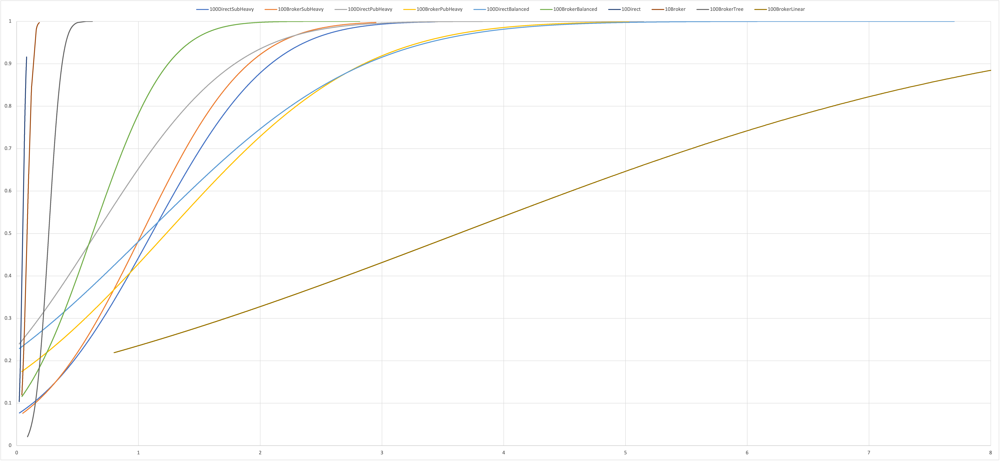

# CS6381 Programming Assignment 1

The tests folder contains a file named 'sourcegen.xlsx' - this was used to generate the command source files for mininet consistent with my applications. The tests in the same folder are the ones I ran for PA1, though I did not report on the ones with only two pub/sub hosts.

Execution of this system can be accomplished by running apps in the following order, concurrently:
- registryapp.py (must specify dissemination method and registry IP, expected number of pubs/subs)
- brokerapp.py (if desired, requires registry IP)
- subapp.py (as many of these as desired, requires registry IP)
- pubapp.py (as many of these as desired, requires registry IP)

The system defaults to 100 publish calls per publisher with random topics and data.

For most experiments (unless otherwise noted) my mininet setup was:
mn --topo=single,{num hosts} --link=tc,bw=100,delay=10ms

# Results
I note that in every "single topology" case utilizing the broker, a greater percentage of time, on average, was spent delivering the message from publisher to broker than from broker to subscriber. The inverse was true for tree and linear topologies.

Running with just 10 hosts gives expected results of very fast transmission times, and with the direct method outperforming the broker method due to the extra network hop.

I loaded the system with 100 pub/sub hosts, and tested these in a balanced configuration (50/50), a publisher heavy configuration (90/10) and a subscriber heavy configuration (90/10).

For a loaded system, the worst performer was a balanced load using direct dissemination.

The best performer was balanced load using broker dissemination.

Unsurprisingly, for a publisher heavy load, the broker performed much worse than the direct method of dissemination.

The subscriber heavy load was the inverse, with the broker dissemination outperforming the direct, but only by a small margin.

When all this was done, I took the best single topology with 100 hosts (balanced broker) and tested this in the linear(102) and tree(depth=3,fanout=5) topologies. The tree topology had significantly faster performance, and the linear topology was by far the worst of the entire experiment.

# Conclusion
The performance characteristics of the system depend heavily on the composition and size of the system. With that in mind, however, the only time the broker method performed significantly worse was in a publisher heavy configuration, which is atypical for the purposes of pub/sub.

